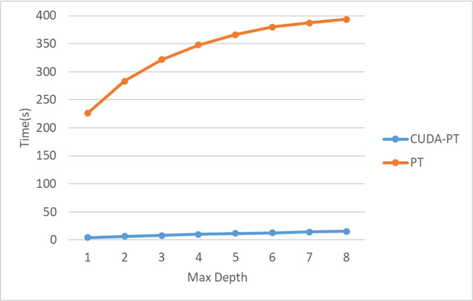

# CUDA Path Tracing
## Project Description
This project implements a physically based path tracer using CUDA acceleration.  
Main features:  
- Create BVH Tree for scene objects
- Handle diffuse material
- Light sampling and Monte Carlo Integration

## Result
 
SPP = 512, MaxDepth = 3. Cornell Box with 6 objects, 5 without emission and 1 light. Color bleeding and soft shadows can be detected from the image.  

## Performance & Analysis
All the output images are fixed to 512 x 512 pixels and the rendering scene has same objects.
First, fix the max depth for each ray and calculate execution time in different SPP. Then fix the SPP and change the max depth. The experiments are done on code with  and without CUDA acceleration.  
  
**SPP = 8**  
  
**Depth = 3**  
When the SPP remains unchanged, path tracing accelerated by CUDA always has a shorter
execution time. As the maximum depth increases, the growth rate of the two methods both tend to slow down. This is because after using Russian Roulette, the probability to perform more in-depth calculations decreases. The number of executions that can be performed also decreases significantly.  
For the experiment with fixed depth, we discover a much greater increase in  these curves, regardless of it is accelerated by CUDA or not. This is because SPP calculation cannot be ignored by possibility, which means all pixels need to perform the exact same number of ray casting. But it is clear that after using CUDA acceleration, the execution
time remains at about 1/40 of the non-accelerated time.   

## TODO Lists
- Reflection and refraction
- Texture mapping
- Real time display and UI
- Denoise
